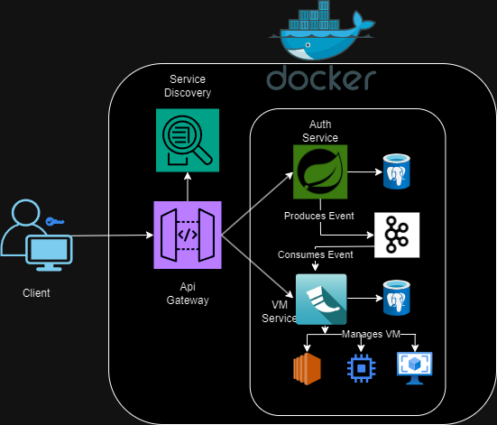
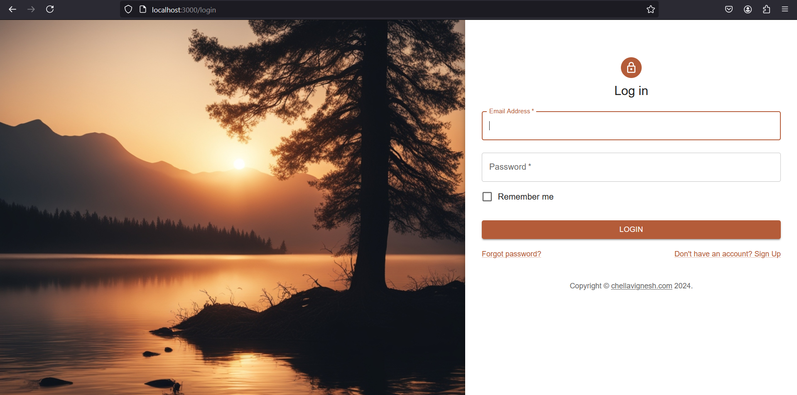
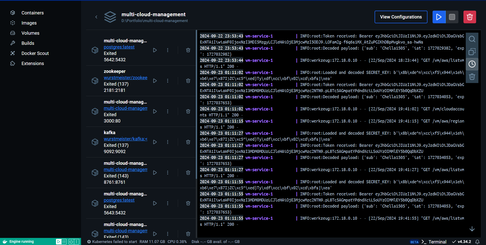
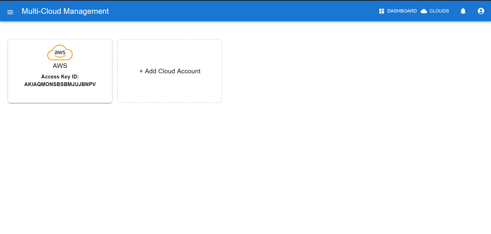
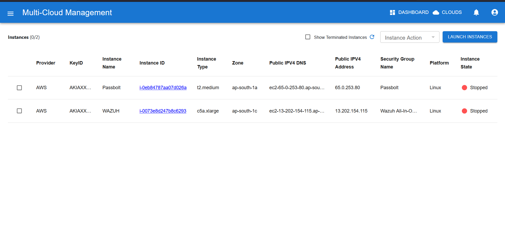
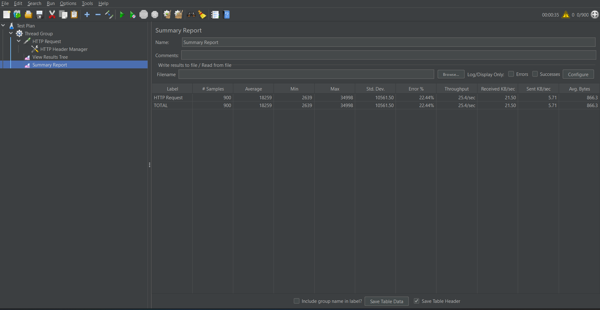

# C-Cloud

### Centralize your Cloud, Streamline your Experience

## Description
C-Cloud is a microservice-based application that enables users to manage virtual machines (VMs) across multiple cloud providers, including AWS, GCP, and Azure. Users can easily add their cloud accounts and manage their VMs from a single interface.

## Installation Instructions

### Prerequisites
- Docker and Docker Compose installed on your machine.

### Architecture Diagram


### Technologies Used
- Spring Boot (Java) for Auth, Admin Server , Config Server, Admin Server and Gateway services.
- Flask (Python) for VM management
- Eureka for service discovery
- Kafka for event-driven communication
- PostgreSQL as the database
- Docker and Docker Compose for containerization
- React for the frontend


### Getting Started
1. Clone the repository:
   ```bash
   git clone https://github.com/ChellaVigneshKP/multi-cloud-management.git
   cd multi-cloud-manager
   ```

2. Set up environment variables for each service by creating `.env` files:
   - **Auth Service `.env` file**:
     ```
     SPRING_DATASOURCE_URL=jdbc:url
     SPRING_DATASOURCE_USERNAME=username
     SPRING_DATASOURCE_PASSWORD=password
     JWT_SECRET_KEY=jwt_key
     SUPPORT_EMAIL=user@mail.com
     APP_PASSWORD=password
     ```

   - **API Gateway `.env` file**:
     ```
     JWT_SECRET_KEY=key
     ```

   - **VM Service `.env` file**:
     ```
     ENCRYPTION_KEY=key
     DB_HOST=hostname
     DB_USER=username
     DB_PASSWORD=password
     DB_NAME=dbname
     KAFKA_BOOTSTRAP_SERVERS=kafka:9093
     KAFKA_TOPIC=user-registration
     SECURITY_JWT_SECRET_KEY=key
     AWS_ACCESS_KEY_ID=key_id
     AWS_SECRET_ACCESS_KEY=key_secreat
     AWS_DEFAULT_REGION=region
     ```

3. Start the application using Docker Compose:
   ```bash
   docker-compose up
   ```

## Usage Instructions
Once the application is running, users can interact with the UI to add their cloud accounts and manage their VMs.

## User Interface

### Login Page


### Registration Page


### Docker Containers


### Add Cloud Account


### Monitor Cloud Instances


## Performance Results

### Non-Cloud Setup
- **HTTP Request Performance**:
  ```
  Label           # Samples  Error %
  HTTP Request    300        52.00%
  TOTAL           300        52.00%
  ```

### Docker/Cloud-Based Setup
- **HTTP Request Performance**:
  ```
  Label           # Samples  Error %
  HTTP Request    300        0.00%
  TOTAL           300        0.00%
  ```

### Docker/Cloud-Based Setup Results

